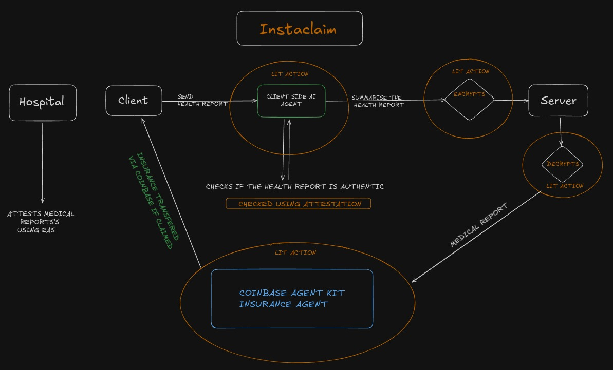

# Instaclaim

**Instaclaim** is a revolutionary platform that simplifies and automates the insurance claims process by integrating cutting-edge **blockchain** and **AI** technologies. By leveraging two AI agents—one on the client side and another on the insurance company’s server—the platform ensures a seamless, efficient, and transparent claims experience.

---

## System Design

<p align="center">
  
</p>

The platform integrates blockchain, AI, and secure data handling mechanisms to create a trustworthy and automated insurance claims process. Its architecture revolves around the following components:

- **Client-Side AI Agent**: Processes user input, encrypts sensitive data, and securely interacts with the server.
- **Server-Side AI Agent**: Verifies claims, processes policies, and automates payouts using smart contract logic.
- **Lit Protocol**: Ensures privacy and security during data transfer and execution of AI actions.
- **Ethereum Attestation Service (EAS)**: Verifies authenticity of health records and claim approvals.

---
## Video demo 
https://www.youtube.com/watch?v=yfKAiwU7HaQ

## Key Features

### 1. **AI-Powered Automation**

- Leverages **Coinbase AgentKit** to autonomously verify insurance policies and process claims.
- Handles claim approvals and denials efficiently with clear reasoning.
- Automates payouts directly to the user’s wallet upon claim approval.

### 2. **Privacy-Preserving Data Handling**

- Utilizes **Lit Protocol** to encrypt sensitive user data on the client side.
- Decrypts and processes data securely on the server using **Lit Actions**.

### 3. **Trust Through Attestations**

- Integrates **Ethereum Attestation Services (EAS)** to authenticate health reports submitted by users.
- Ensures that only hospital-verified documents are considered valid for claims.

### 4. **Blockchain-Backed Security**

- Combines blockchain’s **immutability** with AI’s **efficiency** to deliver a tamper-proof solution.
- Enhances transparency and trust between clients and insurance providers.

---

## Ethereum Attestation Service (EAS)

EAS is used to attest SHA256 hashes of health records along with users’ wallet addresses. This ensures access control and authenticity for sensitive data.

### Workflow:

1. **Hospital Attestation**: Trusted partner hospitals create attestations containing health record hashes and user wallet addresses.
2. **Claim Verification**:
   - When a user submits a claim, their data and wallet address are matched against these attestations.
   - If the hash matches, access is granted to process the claim.

### Schema and Transaction Details:

- **Schema ID for Hospital Records**:
  [View on Sepolia](https://sepolia.easscan.org/schema/view/0x779d51ae429a271b4384453f955b4620375cbc8e727b43c1f4306aab9409038f)
- **Example Attestation ID**:
  `0x2238f03eb415824d725e809253f0c3928e87898cca44eb4121e4ff2815ceccb1`

- **Schema ID for Insurance Records**:
  [View on Base Sepolia](https://base-sepolia.easscan.org/schema/view/0x80eb3e1cd8df4b058822ed156660dbc73753f36efaa1be495a7c8ef40086ecde)
- **Example Attestation ID**:
  `0x2eb5ba3523b17555bd8e6aba7f593e71b57520f329b9fa55286e0d11c932f352`

---

## Deployment of Coinbase Agent

The Coinbase Agent, built using **AgentKit**, is trained with the insurance company’s policies and operates autonomously to:

1. **Approve Claims**: Automatically send payouts to the user’s wallet.
2. **Deny Claims**: Provide clear reasons for denial.

### Example API:

The agent is hosted on Replit using a Python Flask container with an open API for interactions.

**Replit Repo**:
[View Repo](https://replit.com/@architdabral123/onchain-agent-demo-backend?v=1)

**API Usage**:

```bash
curl -X POST https://onchain-agent-demo-backend-architdabral123.replit.app/api/chat \
-H "Content-Type: application/json" \
-d '{"input": "Patricia experienced a severe allergic reaction and went to an emergency room for treatment. The treatment was deemed medically necessary by the attending physician. No coverage limits have been exceeded. Cost of Treatment: 0.002 Wallet: 0xfcd1e86925C9c066d31AacC78c9e7De32b4574Ae", "conversation_id": 0}'
```

## Use of Lit Protocol

The **Lit Protocol** is the backbone of the platform’s security, enabling privacy-preserving interactions and ensuring that sensitive data is handled securely. It is utilized both on the client and server sides to manage encryption, decryption, and access control.

### Workflow of Lit Protocol Integration

#### 1. **Client-Side Operations**

- **AI Agent Execution**: The first AI agent is invoked as a **Lit Action** to process the user’s input.
- **Data Encryption**: The response from the AI agent is encrypted using another **Lit Action**, ensuring that sensitive data remains private during transmission.
- **Secure Transfer**: The encrypted response is sent to the server, ensuring that only authorized entities can decrypt and process the data.

#### 2. **Server-Side Operations**

- **Data Decryption**: Upon receiving the encrypted response, the server decrypts it using **Access Control Conditions (ACC)**. These conditions ensure that only the server’s authorized wallet has access to the data.
- **Claim Processing**: The server-side AI agent then processes the decrypted data to verify the claim and execute the appropriate action (approve or deny).

### Key Advantages of Using Lit Protocol

1. **Privacy Protection**: All sensitive user data is encrypted before transmission and is accessible only to authorized parties.
2. **Trustless Security**: Encryption and decryption are handled through **Lit Actions**, providing a trustless execution environment.
3. **Granular Access Control**: **Access Control Conditions (ACC)** enable precise and conditional access to data based on predefined rules.

### Lit Actions in the Project

1. **Client-Side Lit Actions**:

   - **AI Agent Invocation**: Executes the client-side AI agent as a Lit Action.
   - **Response Encryption**: Encrypts the agent's response for secure transmission.

2. **Server-Side Lit Actions**:
   - **Data Decryption**: Decrypts client-provided data based on ACC.
   - **Secure Processing**: Ensures all claim-related operations are conducted in a secure and trusted environment.

---

By leveraging the Lit Protocol, the platform achieves a robust, privacy-preserving solution that guarantees secure data handling and efficient claim processing.
